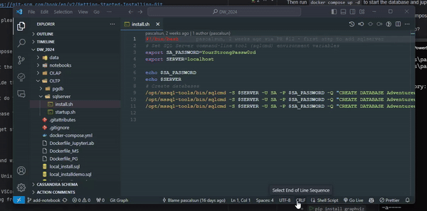

# UWA Data Warehouse 2024 Demo Project

A Data Warehouse project consists of several parts:

- Data collection and settle down, which refers to OLTP (Online Transaction Processing)
- Data transformation and integration, which refers to ETL (Extract, Transform, Load)
- Data Warehouse design and implementation, which refers to OLAP (Online Analytical Processing)
    - The design of the data warehouse normally happens before the ETL process
- Data analysis and visualization, which refers to BI (Business Intelligence)
    - This is the end goal of the data warehouse project, which is to provide insights to the business, answer business
      questions, and help the business make decisions

Let's give the AdventureWorks database as an example to illustrate the above concepts.

`Adventure Works Cycles` is a fictitious, multinational manufacturing company that sells bicycles and accessories.

## Environment Setup

### Step 0: Cloning a repository

```
git clone https://github.com/PascalSun/DW_2024.git
```

If you are not familiar with git, please learn the basic concepts about git and GitHub.

It is a must-have skill for a software engineer.

Here is a good tutorial for beginners: https://www.w3schools.com/git/

And here is official documentation: https://git-scm.com/book/en/v2/Getting-Started-Installing-Git

Also, if you do not have a code editor, please install the VSCODE: https://code.visualstudio.com/download

### For the database part

Make sure you have docker and docker-compose installed on your machine.

Then run `docker compose up -d` to start the database and jupyter lab environment.

Try to understand how many services inside the docker compose file, and what they are used for.

Which part of the data warehouse project do they belong to?

If you are not familiar with docker, please learn the basic concepts about docker.

We just put down a tutorial for you to get started with docker: https://uwa-nlp-tlp.gitbook.io/it-support/docker-101

#### Special part for Windows users

If you run the `docker compose up` command within the powershell or terminal provided by Windows.

Due to the end of file conflict between Unix based and Windows-based systems, sql server will not start properly.

You need to open the whole project with VSCode, and go to the file `OLTP/sqlserver/install.sh`, click right
bottom-corner, and change the line ending from `CRLF` to `LF`, and then save it.

You need to do the same for file `OLTP/sqlserver/startup.sh`.



Then run the `docker compose up -d` command again.

#### Local python dev environment setup

We already provide a container inside the docker-compose file,
but if you want to run the code locally, you can follow the steps below.
We encourage you to explore both options, and understand the pros and cons of each option.
We will not assess it, but the interviewers may ask you about it.

1. Need to install graphviz and corresponding python package
    - `brew install graphviz`
    - `pip install graphviz`

2. Create a virtual environment with python>=3.9
    - `python3 -m venv venv`
    - `source venv/bin/activate`
    - or `conda create -n dw python=3.9 && conda activate dw`
3. Install the requirements
    - `pip install -r requirements.txt`
4. Run Jupyter Lab
    - `jupyter lab`
